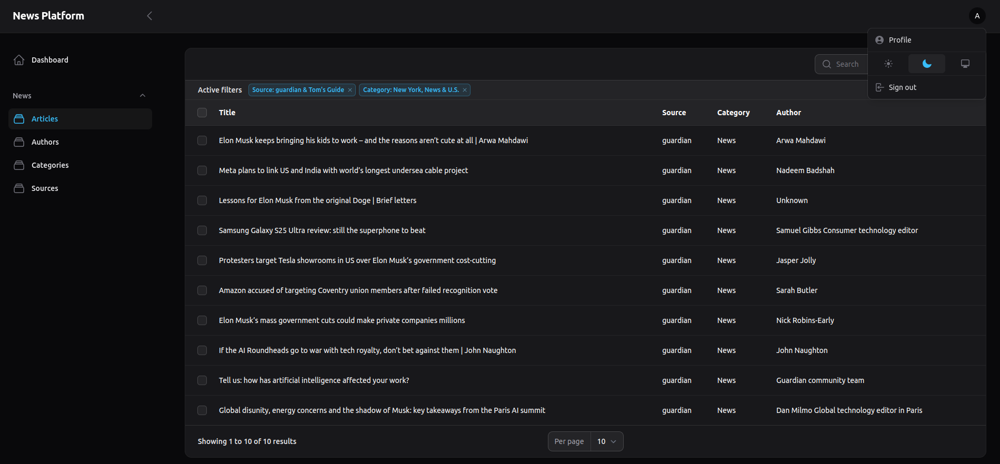
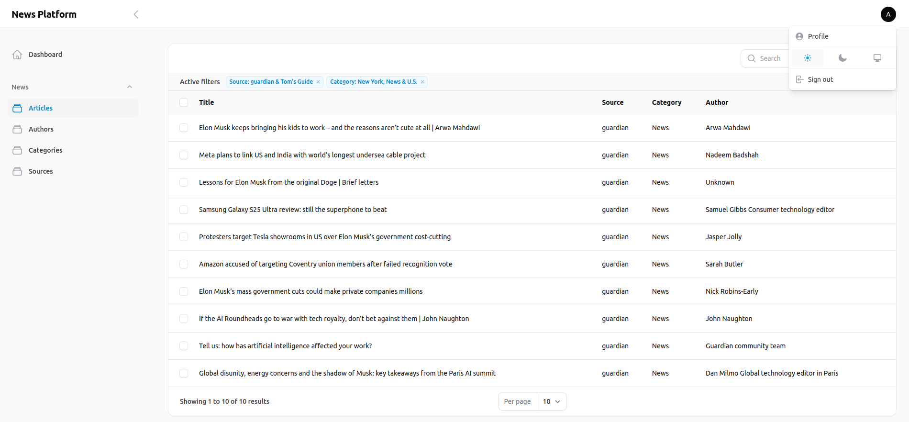
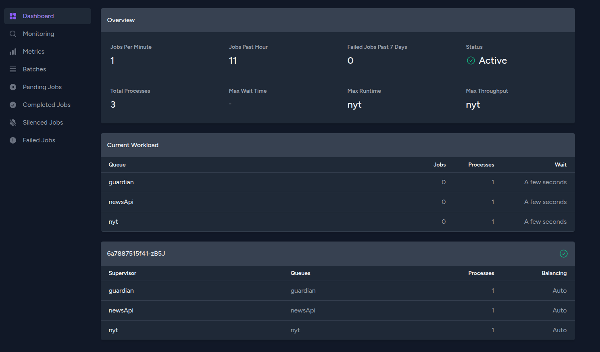

# 📰 News Fetcher

## 🚀 Project Overview

**News Fetcher** is a Laravel-based application that fetches news articles from multiple providers (NewsAPI, The
Guardian, and The New York Times) and provides structured APIs for public and authenticated users. The project follows
clean code principles and design patterns for maintainability and scalability.

---

## 🏗️ Tech Stack

| Technology                                                                                                   | Description              |
|--------------------------------------------------------------------------------------------------------------|--------------------------|
|      | Backend Framework        |
|            | Database                 |
|            | Caching & Queues         |
|         | Containerization         |
|  | Queue Workers Management |

---

## ⚙️ Project Setup

### 1️⃣ Clone the Repository

```sh
git clone https://github.com/elsayed85/news-fetcher.git
cd news-fetcher
```

### 2️⃣ Setup Environment

```sh
cp .env.example .env
```

### 3️⃣ Start Required Services (MySQL, Redis, PHPMyAdmin)

```sh
docker compose -f docker-compose-services.yml up -d
```

### 4️⃣ Start the Application

```sh
docker compose up -d
```

### 5️⃣ Enter the Container

```sh
docker exec -it news-app-container sh
```

### 6️⃣ Install Dependencies & Migrate Database

```sh
composer install
php artisan key:generate
php artisan migrate
php artisan db:seed
```

### 7️⃣ Fix Storage Permissions (if needed)

```sh
chmod -R 777 storage
```

---

## 📌 Features

### ✅ Fetching News (Scheduled Jobs & Queues)

- Each provider has a dedicated **command** that runs on a schedule to fetch news.
- Commands dispatch **provider jobs** to a **Redis queue** for processing.
- **Supervisor** manages queue workers to handle jobs efficiently.

### ✅ Job Processing

- Fetches data from provider APIs using a **Request Builder** to structure API calls.
- Uses **Adapters & DTOs** to transform API responses into a standardized format.
- **Caches categories, sources, and authors** to reduce database queries.
- Saves transformed data into the database efficiently.

### ✅ RESTful API Endpoints

#### 🔓 Public APIs:

- **Articles:** List & Show
- **Categories:** List
- **Sources:** List
- **Authors:** List

#### 🔐 Authenticated User APIs:

- **Articles:** List filtered by user preferences (**Categories, Sources, Authors**)

📌 **Full API Documentation:** [Postman Docs](https://documenter.getpostman.com/view/30884782/2sAYXFiHMc)

### ✅ Admin Panel (Filament)




- **Filament Admin Panel** for managing users, articles, categories, sources, and authors.
- to access the admin panel, visit `/admin/login` and login with the default credentials:
    - **Email:** ` admin@news.com`
    - **Password:** `password`

### Queue Monitoring (Laravel Horizon)



- **Laravel Horizon** provides a dashboard to monitor queue jobs.
- To access the dashboard, visit `/horizon` and login to admin first using the previous credentials.

---

## Design Patterns Used 🏗️

- **Service Layer**: Business logic is encapsulated in service classes.
- **Repository Pattern**: Data access is abstracted using repositories.
- **Adapter Pattern**: Each news provider has an adapter to normalize its response format.
- **Builder Pattern**: Request parameters are dynamically constructed.
- **DTOs (Data Transfer Objects)**: Ensures data consistency across layers.
- **Factory Pattern**: Used for object instantiation and dependency injection.
- **Filter Pattern**: Query filtering is handled dynamically for various models.

---

## 🔑 Generating User Token for Testing

To test authenticated API requests, generate an access token:

```sh
php artisan generate:user-token
```

This will create a test user and return an API token that can be used for authentication.

---

## 🎯 Attaching User Preferences for Testing

To simulate user-specific news filtering, attach preferences (categories, sources, authors) to a test user:

```sh
php artisan attach:user-preferences
```

This ensures the API correctly filters news articles based on user settings.

---

## 🛠️ Testing Scheduled Commands

```md
---

## 🛠️ Testing Scheduled Commands

To manually test the scheduled commands before running them in production, use:

```sh
php artisan schedule:test
```

This will prompt you to select a command from the available scheduled tasks, allowing you to verify that each provider
fetches news correctly.

### Example Output:

```sh
 ┌ Which command would you like to run? ─────────────────────────────────────────────────────────────────────┐
 │ › ● '/usr/bin/php82' 'artisan' guardian:fetch-and-save 'technology' --from-date='2024-01-01' --page='1'   │
 │   ○ '/usr/bin/php82' 'artisan' news-api:fetch-and-save 'technology'                                       │
 │   ○ '/usr/bin/php82' 'artisan' nyt:fetch-and-save 'technology'                                            │
 └───────────────────────────────────────────────────────────────────────────────────────────────────────────┘

  Running ['artisan' guardian:fetch-and-save 'technology' --from-date='2024-01-01' --page='1'] ... DONE (114ms)
```

---

## 🚀 Possible Improvements

1️⃣ **Add a Custom Logging Layer for Tracking**  
2️⃣ **Filament Admin Panel for Full Control ✅**  
3️⃣ **Generalized Category Mapping**  
4️⃣ **Filter by API Source**  
5️⃣ **Authentication Routes (Login, Register, Forgot Password, Reset, Logout)**  
6️⃣ **User Preferences Update API**  
7️⃣ **Setup Laravel Horizon for Queue Monitoring ✅**  
